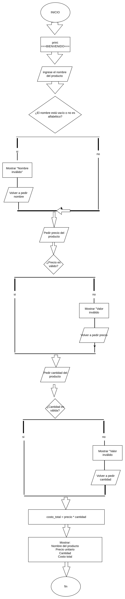

# BIENVIDO A ESTE README DETALLADO 

## De que trata: 
trata sobre un programa sencillo de inventario, en el cual los clientes ingresan datos sobre su compra,
como lo son:

-nombre del producto
-precio del producto
-cantidad del producto.

para luego calcular el toatal de su compra, dando un tipo de recibo detallado sobre que compro,
cuantas unidades, el precio del producto, el nombre del producto y por ultimo su "total a pagar".

## Diagrama de flujo:

## Requerimientos: 
1. Debes tener instalado python en tu dispositivo, de no tenerlo dirijete a la pagina oficial de python y descarga la ultima version.d
2. tambien debes tener instalado git, de no tenerlo vamos a el buscador y ponemos git y lo instalamos. 

## Proceso detallado para la ejecucion correcta: 
Para la correcta ejecucion del programa le invito a seguir los siguientes pasos, que le llevaran 
a la ejecucion del programa por terminal y asi hacer una prueba sencilla de el.

### Paso 1: Clonar el repositorio: 

1. vamos al repisitorio y damos en la opcion (<> code), luego copiamos el url que aprece al abrir la pequeña ventana.
2. abrimos la terminal de nuestro dispositivo (ejecutar terminal para windows, presiona la tecla windows + R, luego escribe cmd)
(ejecutar terminal en linux, presiona las teclas control + alt + t)
3. escribimos el siguiente comando git clone y pegamos la url( git clone https://github.com/gutierrezrretamozoj-beep/historia-de-usuario--inventario.git)

### Paso 2: Ejecutar el programa:
1 luego insertamos el siguiente comando cd mas el nombre de la carpeta (cd historia-de-usuario--inventario)
2 luego damos python3 mas el nombre del archivo (python3 inventario)

## Como utilizar correctamente el programa: 
luego de ejecutar el progama te pedira el nombre del producto,debes ingresar un valor valido (un nombre de solo letras)
de lo contrario arrojara error.

luego te pedira ingresar el precio del producto, debes ingresar unprecio valido (solo numeros,que no sean negativos)
de lo contrario arroja error.

luego te pedira la cantidad del producto, dedes ingresar una cantidad valida(solo numeros enteros)
de lo contrario arrojara eror 